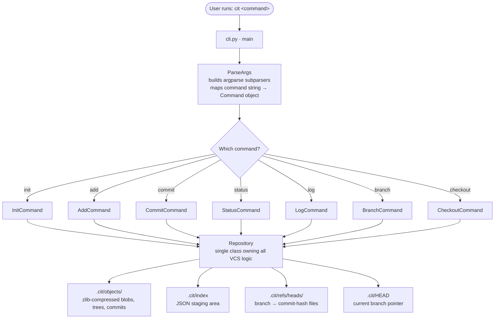
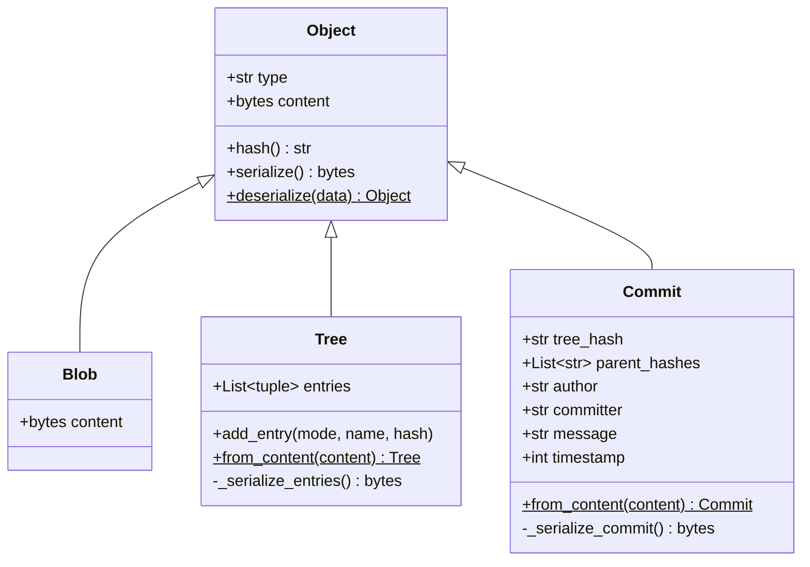
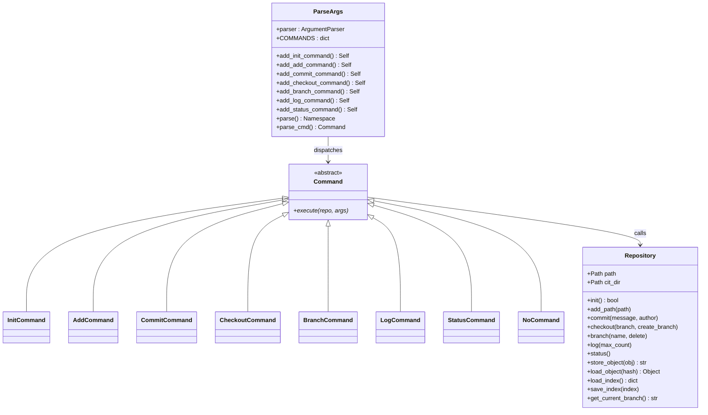
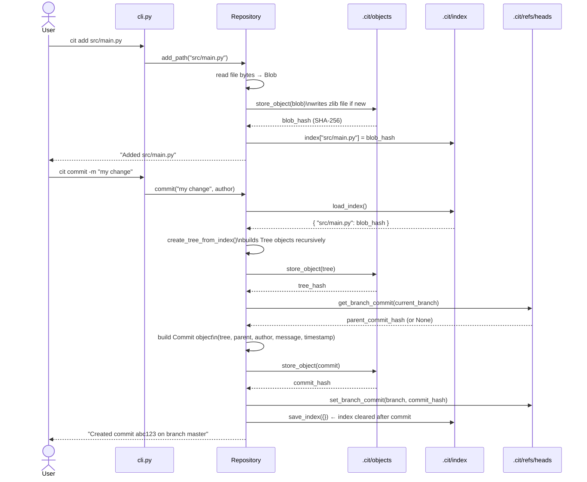

# Cit

> A simplified Git clone written in Python — built to understand how version control systems work under the hood.


---

## What is Cit?

**Cit** is a didactic implementation of a version control system modelled after Git. It stores file snapshots as compressed, content-addressed objects in a `.cit/` directory, tracks staged files in a JSON index, and manages branches as simple ref files — the same fundamental design Git uses, stripped down to its essence.

It supports the core day-to-day workflow:

| Command | Description |
|---|---|
| `cit init` | Initialise a new repository |
| `cit add <path>` | Stage a file or directory |
| `cit commit -m <msg>` | Record a snapshot of the index |
| `cit status` | Show staged, modified, and untracked files |
| `cit log [-n N]` | Print commit history |
| `cit branch [name] [-d]` | List, create, or delete branches |
| `cit checkout <branch> [-b]` | Switch branches (optionally creating one) |

---

## Build & Install

**Requirements:** Python 3.8+, no external dependencies.

```bash
git clone https://github.com/AbrarShakhi/cit.git
cd cit
pip install -e .
```

The `cit` command is then available system-wide via the `cit.cli:main` entry point defined in `pyproject.toml`.

### Quick start

```bash
mkdir my-project && cd my-project
cit init

echo "hello" > hello.txt
cit add hello.txt
cit commit -m "initial commit"

cit branch feature
cit checkout feature
# ... make changes ...
cit add .
cit commit -m "add feature"

cit log
cit status
```

---

## How Cit Works

### High-level architecture

Every `cit` invocation follows a single linear path:



### `.cit/` directory layout

```
.cit/
├── HEAD                        # e.g. "ref: refs/heads/master"
├── index                       # JSON: { "src/foo.py": "<sha256>", ... }
├── objects/
│   ├── 3a/                     # first 2 hex chars of SHA-256
│   │   └── f9c1...             # remaining 62 hex chars → zlib blob
│   └── ...
└── refs/
    └── heads/
        ├── master              # contains commit hash
        └── feature-branch
```

### Class diagrams

#### Object model



#### Command layer



### Commit workflow — sequence diagram



---

## Cit vs Git

| Feature | Git | Cit |
|---|---|---|
| Hash algorithm | SHA-1 (SHA-256 opt-in since 2.29) | SHA-256 |
| Object types | blob, tree, commit, tag | blob, tree, commit |
| Index format | Binary packed format | Plain JSON |
| Object compression | zlib | zlib |
| Object storage layout | `.git/objects/<2>/<62>` | `.cit/objects/<2>/<62>` |
| Branches | Files in `refs/heads/` | Files in `refs/heads/` |
| Remote support | Yes (`fetch`, `push`, `pull`, `clone`) | No |
| Diff & merge | Yes | No |
| Pack files | Yes (for efficiency) | No (loose objects only) |
| `.gitignore` support | Yes | No |
| Staging removal | `git rm --cached` | Not supported |
| Detached HEAD | Yes | Not supported |
| Config file | `.git/config` | Not supported |
| Commit signing | Yes (GPG/SSH) | No |

The structural design is intentionally similar: the object storage scheme, content-addressing, branch-as-ref-file, and HEAD indirection are all direct analogues of Git's internals.

---

## Limitations

- **No remote operations** — there is no `clone`, `fetch`, `push`, or `pull`.
- **No diff or merge** — branch divergence cannot be reconciled.
- **No `.gitignore`** — all files in the working tree are visible to `cit status` and `cit add`.
- **Tree hash truncation** — SHA-256 produces 64 hex characters, but tree entries are serialised as raw bytes with only 20 bytes stored (same slot size as Git's SHA-1). On deserialisation, only a 40-char hex string is recovered. Object lookups still work because `store_object` uses the full 64-char hash for the file path; the truncated value is stored internally in tree entries only.
- **Author hardcoded** — the `--author` flag is not wired up; all commits record `<user@cithub.com>`.
- **No pack files** — every object is a separate file; large repositories will be slow.
